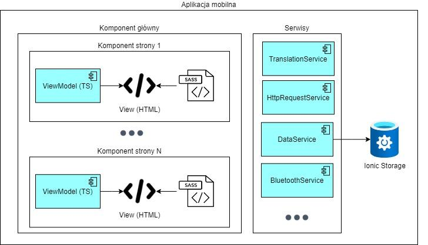

# Diagram komponentów

[Trzeci z diagramów modelu C4. Prezentuje strukturę wewnętrzną komponentów, jeśli jest to możliwe. Najczęściej znajduje się tu kilka diagramów. Diagram jest użyteczny głównie w momencie, jeśli chcemy pokazać wewnętrzną strukturę np. frontendu, a tym samym obsługującego go frameworku. Nie zawsze ten diagram jest wymagany, szczególnie gdy jego przygotowanie zajmuje zbyt dużo czasu.]
Decydując się na aplikację mobilną tworzoną przy użyciu frameworka Angular, odpowiednia struktura komponentów oprogramowania przedstawia się następująco:

